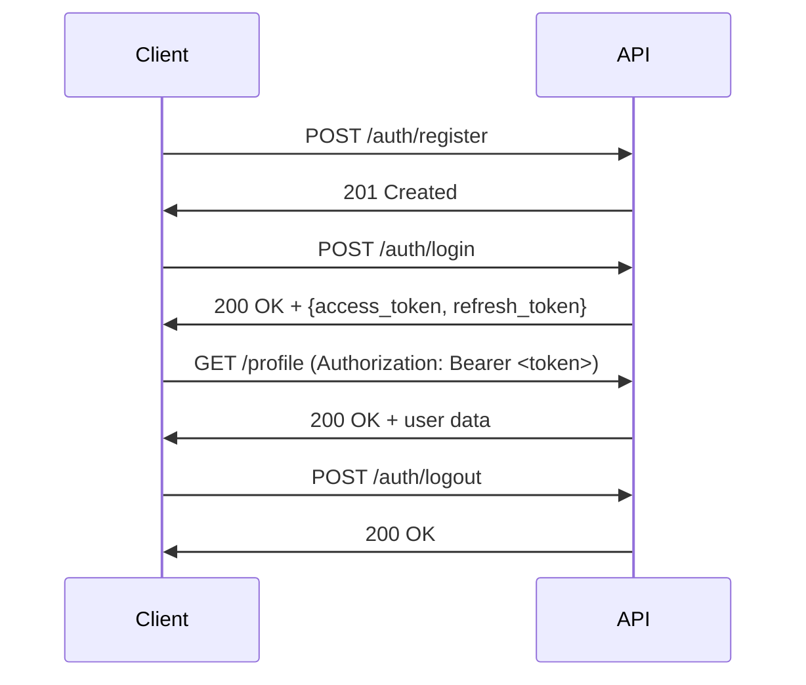

# BlockScore API Reference

Complete REST API documentation for BlockScore backend services.

## Table of Contents

- [Base URL](#base-url)
- [Authentication](#authentication)
- [Endpoints](#endpoints)
    - [Health & Status](#health--status)
    - [Authentication](#authentication-endpoints)
    - [Credit Score](#credit-score-endpoints)
    - [Loan Management](#loan-management-endpoints)
    - [User Profile](#user-profile-endpoints)
- [Error Handling](#error-handling)
- [Rate Limiting](#rate-limiting)

## Base URL

| Environment | Base URL                                |
| ----------- | --------------------------------------- |
| Development | `http://localhost:5000/api`             |
| Staging     | `https://staging-api.blockscore.io/api` |
| Production  | `https://api.blockscore.io/api`         |

## Authentication

BlockScore uses JWT (JSON Web Tokens) for authentication.

### Authentication Flow



### Token Management

| Header          | Value                   | Description                           |
| --------------- | ----------------------- | ------------------------------------- |
| `Authorization` | `Bearer <access_token>` | Include in all authenticated requests |
| `Content-Type`  | `application/json`      | Required for POST/PUT requests        |

**Token Expiration:**

- Access Token: 15 minutes (900 seconds)
- Refresh Token: 7 days (604800 seconds)

## Endpoints

### Health & Status

#### GET /api/health

Check system health and service status.

**Authentication**: Not required

**Request:**

```bash
curl -X GET http://localhost:5000/api/health
```

**Response:** `200 OK`

```json
{
    "success": true,
    "status": "healthy",
    "timestamp": "2024-12-30T15:30:00.000Z",
    "version": "1.0.0",
    "services": {
        "database": "up",
        "redis": "up",
        "blockchain": "up",
        "ai_model": "up"
    },
    "request_id": "a1b2c3d4"
}
```

**Health Status Table:**

| Service      | Status                           | Description                      |
| ------------ | -------------------------------- | -------------------------------- |
| `database`   | `up` / `down`                    | PostgreSQL/SQLite connection     |
| `redis`      | `up` / `down` / `not_configured` | Redis cache availability         |
| `blockchain` | `up` / `down`                    | Ethereum/Polygon node connection |
| `ai_model`   | `up` / `down`                    | Credit scoring model loaded      |

### Authentication Endpoints

#### POST /api/auth/register

Register a new user account.

**Authentication**: Not required  
**Rate Limit**: 5 requests per minute

**Request Body:**

| Field      | Type   | Required | Validation                                      | Description        |
| ---------- | ------ | -------- | ----------------------------------------------- | ------------------ |
| `email`    | string | Yes      | Valid email format                              | User email address |
| `password` | string | Yes      | Min 8 chars, mixed case, numbers, special chars | User password      |

**Example Request:**

```bash
curl -X POST http://localhost:5000/api/auth/register \
  -H "Content-Type: application/json" \
  -d '{
    "email": "user@example.com",
    "password": "SecurePass123!"
  }'
```

**Response:** `201 Created`

```json
{
    "success": true,
    "message": "User registered successfully",
    "user": {
        "id": "550e8400-e29b-41d4-a716-446655440000",
        "email": "user@example.com",
        "status": "pending",
        "created_at": "2024-12-30T15:30:00.000Z"
    }
}
```

**Error Responses:**

| Status | Error             | Description          |
| ------ | ----------------- | -------------------- |
| `400`  | Bad Request       | Invalid input data   |
| `409`  | Conflict          | Email already exists |
| `429`  | Too Many Requests | Rate limit exceeded  |

#### POST /api/auth/login

Authenticate user and receive tokens.

**Authentication**: Not required  
**Rate Limit**: 5 requests per minute

**Request Body:**

| Field      | Type   | Required | Description              |
| ---------- | ------ | -------- | ------------------------ |
| `email`    | string | Yes      | Registered email address |
| `password` | string | Yes      | User password            |

**Example Request:**

```bash
curl -X POST http://localhost:5000/api/auth/login \
  -H "Content-Type: application/json" \
  -d '{
    "email": "user@example.com",
    "password": "SecurePass123!"
  }'
```

**Response:** `200 OK`

```json
{
    "success": true,
    "message": "Login successful",
    "user": {
        "id": "550e8400-e29b-41d4-a716-446655440000",
        "email": "user@example.com",
        "status": "active",
        "last_login": "2024-12-30T15:30:00.000Z"
    },
    "tokens": {
        "access_token": "eyJhbGciOiJIUzI1NiIsInR5cCI6IkpXVCJ9...",
        "refresh_token": "eyJhbGciOiJIUzI1NiIsInR5cCI6IkpXVCJ9..."
    }
}
```

**Error Responses:**

| Status | Error             | Description                |
| ------ | ----------------- | -------------------------- |
| `401`  | Unauthorized      | Invalid credentials        |
| `423`  | Locked            | Account temporarily locked |
| `429`  | Too Many Requests | Rate limit exceeded        |

#### POST /api/auth/logout

Logout user and invalidate tokens.

**Authentication**: Required  
**Rate Limit**: 100 requests per hour

**Request:**

```bash
curl -X POST http://localhost:5000/api/auth/logout \
  -H "Authorization: Bearer <access_token>"
```

**Response:** `200 OK`

```json
{
    "success": true,
    "message": "Logout successful"
}
```

### Credit Score Endpoints

#### POST /api/credit/calculate-score

Calculate or recalculate credit score for authenticated user.

**Authentication**: Required  
**Rate Limit**: 10 requests per minute

**Request Body:**

| Field                 | Type    | Required | Default       | Description                                     |
| --------------------- | ------- | -------- | ------------- | ----------------------------------------------- |
| `walletAddress`       | string  | No       | User's wallet | Ethereum wallet address                         |
| `force_recalculation` | boolean | No       | `false`       | Force recalculation even if recent score exists |

**Example Request:**

```bash
curl -X POST http://localhost:5000/api/credit/calculate-score \
  -H "Authorization: Bearer <access_token>" \
  -H "Content-Type: application/json" \
  -d '{
    "walletAddress": "0x742d35Cc6634C0532925a3b844Bc454e4438f44e",
    "force_recalculation": false
  }'
```

**Response:** `200 OK`

```json
{
    "success": true,
    "data": {
        "credit_score_id": "cs_123456789",
        "score": 720,
        "score_range": {
            "min": 300,
            "max": 850
        },
        "rating": "Good",
        "calculated_at": "2024-12-30T15:30:00.000Z",
        "model_version": "1.2.0",
        "factors": [
            {
                "factor": "Excellent payment history",
                "impact": "positive",
                "description": "Consistently repaying debts on time"
            },
            {
                "factor": "Low debt ratio",
                "impact": "positive",
                "description": "Low amount of debt relative to income"
            }
        ],
        "recommendations": ["Continue making on-time payments", "Maintain low credit utilization"]
    }
}
```

**Score Rating Table:**

| Score Range | Rating      | Description                            |
| ----------- | ----------- | -------------------------------------- |
| 800-850     | Exceptional | Excellent creditworthiness             |
| 740-799     | Very Good   | Above average creditworthiness         |
| 670-739     | Good        | Near or above average creditworthiness |
| 580-669     | Fair        | Below average creditworthiness         |
| 300-579     | Poor        | Well below average creditworthiness    |

#### GET /api/credit/history

Retrieve credit history for authenticated user.

**Authentication**: Required  
**Rate Limit**: 100 requests per hour

**Query Parameters:**

| Parameter  | Type    | Required | Default | Description                |
| ---------- | ------- | -------- | ------- | -------------------------- |
| `page`     | integer | No       | `1`     | Page number for pagination |
| `per_page` | integer | No       | `20`    | Items per page (max 100)   |

**Example Request:**

```bash
curl -X GET "http://localhost:5000/api/credit/history?page=1&per_page=20" \
  -H "Authorization: Bearer <access_token>"
```

**Response:** `200 OK`

```json
{
    "success": true,
    "data": {
        "history": [
            {
                "id": "ch_123456",
                "event_type": "loan_payment",
                "event_date": "2024-12-15T10:00:00.000Z",
                "amount": 500.0,
                "impact": "positive",
                "description": "On-time loan payment"
            },
            {
                "id": "ch_123457",
                "event_type": "credit_inquiry",
                "event_date": "2024-12-10T14:30:00.000Z",
                "impact": "neutral",
                "description": "Credit check for loan application"
            }
        ],
        "pagination": {
            "page": 1,
            "per_page": 20,
            "total": 45,
            "pages": 3,
            "has_next": true,
            "has_prev": false
        }
    }
}
```

### Loan Management Endpoints

#### POST /api/loans/apply

Submit a new loan application.

**Authentication**: Required  
**Rate Limit**: 3 requests per hour

**Request Body:**

| Field                   | Type    | Required | Description                 | Example                                    |
| ----------------------- | ------- | -------- | --------------------------- | ------------------------------------------ |
| `loan_type`             | string  | Yes      | Type of loan                | `personal`, `mortgage`, `auto`, `business` |
| `requested_amount`      | number  | Yes      | Loan amount requested       | `10000.00`                                 |
| `requested_term_months` | integer | Yes      | Loan term in months         | `36`                                       |
| `requested_rate`        | number  | No       | Desired interest rate (%)   | `5.5`                                      |
| `application_data`      | object  | No       | Additional application info | `{}`                                       |

**Example Request:**

```bash
curl -X POST http://localhost:5000/api/loans/apply \
  -H "Authorization: Bearer <access_token>" \
  -H "Content-Type: application/json" \
  -d '{
    "loan_type": "personal",
    "requested_amount": 10000.00,
    "requested_term_months": 36,
    "requested_rate": 5.5,
    "application_data": {
      "purpose": "Debt consolidation",
      "employment_status": "employed"
    }
  }'
```

**Response:** `201 Created`

```json
{
    "success": true,
    "message": "Loan application submitted successfully",
    "data": {
        "id": "la_987654321",
        "application_number": "LA-2024-001234",
        "status": "submitted",
        "loan_type": "personal",
        "requested_amount": 10000.0,
        "requested_term_months": 36,
        "requested_rate": 5.5,
        "credit_score_at_application": 720,
        "approval_probability": 78.5,
        "submitted_at": "2024-12-30T15:30:00.000Z",
        "estimated_response_time": "24-48 hours"
    }
}
```

**Loan Types:**

| Type       | Description             | Typical Amount Range |
| ---------- | ----------------------- | -------------------- |
| `personal` | Personal unsecured loan | $1,000 - $50,000     |
| `mortgage` | Home purchase loan      | $50,000 - $1,000,000 |
| `auto`     | Vehicle purchase loan   | $5,000 - $100,000    |
| `business` | Business loan           | $10,000 - $500,000   |

#### POST /api/loans/calculate

Calculate loan terms and payment schedule.

**Authentication**: Required  
**Rate Limit**: 100 requests per hour

**Request Body:**

| Field         | Type    | Required | Default | Description              |
| ------------- | ------- | -------- | ------- | ------------------------ |
| `amount`      | number  | No       | `1000`  | Loan amount              |
| `rate`        | number  | No       | `5.0`   | Annual interest rate (%) |
| `term_months` | integer | No       | `36`    | Loan term in months      |

**Example Request:**

```bash
curl -X POST http://localhost:5000/api/loans/calculate \
  -H "Authorization: Bearer <access_token>" \
  -H "Content-Type: application/json" \
  -d '{
    "amount": 10000,
    "rate": 5.5,
    "term_months": 36
  }'
```

**Response:** `200 OK`

```json
{
    "success": true,
    "data": {
        "loan_amount": 10000.0,
        "interest_rate": 5.5,
        "term_months": 36,
        "monthly_payment": 301.96,
        "total_payment": 10870.56,
        "total_interest": 870.56,
        "approval_probability": 78.5,
        "credit_score": 720
    }
}
```

### User Profile Endpoints

#### GET /api/profile

Get authenticated user's profile information.

**Authentication**: Required  
**Rate Limit**: 100 requests per hour

**Example Request:**

```bash
curl -X GET http://localhost:5000/api/profile \
  -H "Authorization: Bearer <access_token>"
```

**Response:** `200 OK`

```json
{
    "success": true,
    "data": {
        "id": "550e8400-e29b-41d4-a716-446655440000",
        "email": "user@example.com",
        "status": "active",
        "created_at": "2024-01-15T10:00:00.000Z",
        "last_login": "2024-12-30T15:30:00.000Z",
        "profile": {
            "wallet_address": "0x742d35Cc6634C0532925a3b844Bc454e4438f44e",
            "full_name": "John Doe",
            "kyc_status": "approved",
            "credit_score": 720,
            "last_score_update": "2024-12-30T15:30:00.000Z"
        }
    }
}
```

## Error Handling

### Standard Error Response

All errors follow this format:

```json
{
    "success": false,
    "error": "Error Type",
    "message": "Detailed error message",
    "request_id": "a1b2c3d4"
}
```

### HTTP Status Codes

| Status Code | Description           | Common Causes                     |
| ----------- | --------------------- | --------------------------------- |
| `200`       | OK                    | Successful request                |
| `201`       | Created               | Resource created successfully     |
| `400`       | Bad Request           | Invalid input, validation failure |
| `401`       | Unauthorized          | Missing or invalid authentication |
| `403`       | Forbidden             | Insufficient permissions          |
| `404`       | Not Found             | Resource doesn't exist            |
| `409`       | Conflict              | Resource already exists           |
| `423`       | Locked                | Account temporarily locked        |
| `429`       | Too Many Requests     | Rate limit exceeded               |
| `500`       | Internal Server Error | Server-side error                 |
| `503`       | Service Unavailable   | Service temporarily unavailable   |

### Error Examples

#### 400 Bad Request

```json
{
    "success": false,
    "error": "Bad Request",
    "message": "The request could not be understood by the server due to malformed syntax.",
    "request_id": "a1b2c3d4"
}
```

#### 401 Unauthorized

```json
{
    "success": false,
    "error": "Unauthorized",
    "message": "Authentication is required to access this resource.",
    "request_id": "a1b2c3d4"
}
```

#### 429 Rate Limit Exceeded

```json
{
    "success": false,
    "error": "Rate Limit Exceeded",
    "message": "Too many requests. Please try again later.",
    "request_id": "a1b2c3d4"
}
```

## Rate Limiting

### Rate Limit Headers

Every API response includes rate limit information:

```
X-RateLimit-Limit: 100
X-RateLimit-Remaining: 95
X-RateLimit-Reset: 1704034200
```

### Rate Limits by Endpoint

| Endpoint                      | Rate Limit   | Window     |
| ----------------------------- | ------------ | ---------- |
| `/api/auth/register`          | 5 requests   | per minute |
| `/api/auth/login`             | 5 requests   | per minute |
| `/api/auth/logout`            | 100 requests | per hour   |
| `/api/credit/calculate-score` | 10 requests  | per minute |
| `/api/credit/history`         | 100 requests | per hour   |
| `/api/loans/apply`            | 3 requests   | per hour   |
| `/api/loans/calculate`        | 100 requests | per hour   |
| `/api/profile`                | 100 requests | per hour   |
| Default (all other endpoints) | 100 requests | per hour   |

## API Client Examples

### Python

```python
import requests

BASE_URL = "http://localhost:5000/api"

# Register
response = requests.post(f"{BASE_URL}/auth/register", json={
    "email": "user@example.com",
    "password": "SecurePass123!"
})
print(response.json())

# Login
response = requests.post(f"{BASE_URL}/auth/login", json={
    "email": "user@example.com",
    "password": "SecurePass123!"
})
tokens = response.json()["tokens"]
access_token = tokens["access_token"]

# Calculate Credit Score
headers = {"Authorization": f"Bearer {access_token}"}
response = requests.post(
    f"{BASE_URL}/credit/calculate-score",
    headers=headers,
    json={"walletAddress": "0x742d35Cc6634C0532925a3b844Bc454e4438f44e"}
)
print(response.json())
```

### JavaScript/Node.js

```javascript
const axios = require('axios');

const BASE_URL = 'http://localhost:5000/api';

async function example() {
    // Register
    const registerRes = await axios.post(`${BASE_URL}/auth/register`, {
        email: 'user@example.com',
        password: 'SecurePass123!',
    });

    // Login
    const loginRes = await axios.post(`${BASE_URL}/auth/login`, {
        email: 'user@example.com',
        password: 'SecurePass123!',
    });
    const accessToken = loginRes.data.tokens.access_token;

    // Calculate Credit Score
    const scoreRes = await axios.post(
        `${BASE_URL}/credit/calculate-score`,
        { walletAddress: '0x742d35Cc6634C0532925a3b844Bc454e4438f44e' },
        { headers: { Authorization: `Bearer ${accessToken}` } },
    );
    console.log(scoreRes.data);
}
```

### cURL

```bash
# Register
curl -X POST http://localhost:5000/api/auth/register \
  -H "Content-Type: application/json" \
  -d '{"email":"user@example.com","password":"SecurePass123!"}'

# Login
TOKEN=$(curl -X POST http://localhost:5000/api/auth/login \
  -H "Content-Type: application/json" \
  -d '{"email":"user@example.com","password":"SecurePass123!"}' \
  | jq -r '.tokens.access_token')

# Calculate Score
curl -X POST http://localhost:5000/api/credit/calculate-score \
  -H "Authorization: Bearer $TOKEN" \
  -H "Content-Type: application/json" \
  -d '{"walletAddress":"0x742d35Cc6634C0532925a3b844Bc454e4438f44e"}'
```

## Next Steps

- [Usage Guide](USAGE.md) - Common usage patterns
- [Examples](examples/) - Complete working examples
- [Configuration](CONFIGURATION.md) - API configuration options

---

**Need Help?** Check the [Troubleshooting Guide](TROUBLESHOOTING.md) or [GitHub Issues](https://github.com/quantsingularity/BlockScore/issues).
